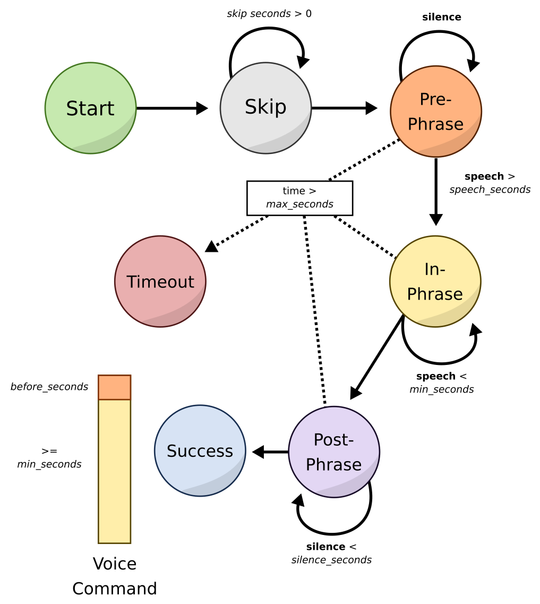

# Rhasspy Silence

[](https://github.com/rhasspy/rhasspy-silence/actions)
[](https://github.com/rhasspy/rhasspy-silence/blob/master/LICENSE)

Detect speech/silence in voice commands with [webrtcvad](https://github.com/wiseman/py-webrtcvad).

## Requirements

* Python 3.7
* [webrtcvad](https://github.com/wiseman/py-webrtcvad)

## Installation

```bash
$ git clone https://github.com/rhasspy/rhasspy-silence
$ cd rhasspy-silence
$ ./configure
$ make
$ make install
```

## How it Works

`rhasspy-silence` uses a state machine to decide when a voice command has started and stopped. The variables that control this machine are:

* `skip_seconds` - seconds of audio to skip before voice command detection starts
* `speech_seconds` - seconds of speech before voice command has begun
* `before_seconds` - seconds of audio to keep before voice command has begun
* `minimum_seconds` - minimum length of voice command (seconds)
* `maximum_seconds` - maximum length of voice command before timeout (seconds, None for no timeout)
* `silence_seconds` - seconds of silence before a voice command has finished

The sensitivity of `webrtcvad` is set with `vad_mode`, which is a value between 0 and 3 with 0 being the most sensitive.

[](docs/img/state_machine.svg)

If there is no timeout, the final voice command audio will consist of:

* `before_seconds` worth of audio before the voice command had started
* At least `min_seconds` of audio during the voice command

### Energy-Based Silence Detection

Besides just `webrtcvad`, silence detection using the denoised energy of the incoming audio is also supported. There are two energy-based methods:

* Threshold - simple threshold where energy above is considered speech and energy below is silence
* Max/Current Ratio - ratio of maximum energy and current energy value is compared to a threshold
    * Ratio above threshold is considered speech, ratio below is silence
    * Maximum energy value can be provided (static) or set from observed audio (dynamic)
    
Both of the energy methods can be combined with `webrtcvad`. When combined, audio is considered to be silence unless **both** methods detect speech - i.e., `webrtcvad` classifies the audio chunk as speech and the energy value/ratio is above threshold. You can even combine all three methods using `SilenceMethod.ALL`.

# Command Line Interface

A CLI is included to test out the different parameters and silence detection methods. After installation, pipe raw 16-bit 16Khz mono audo to the `bin/rhasspy-silence` script:

```sh
$ arecord -r 16000 -f S16_LE -c 1 -t raw | bin/rhasspy-silence <ARGS>
```

The characters printed to the console indicate how `rhasspy-silence` is classifying audio frames:

* `.` - silence
* `!` - speech
* `S` - transition from silence to speech
* `-` - transition from speech to silence
* `[` - start of voice command
* `]` - end of voice command
* `T` - timeout

By changing the `--output-type` argument, you can have the current audio energy or max/current ratio printed instead. These values can then be used to set threshold values for further testing.

## CLI Arguments

```
usage: rhasspy-silence [-h]
                       [--output-type {speech_silence,current_energy,max_current_ratio}]
                       [--chunk-size CHUNK_SIZE] [--skip-seconds SKIP_SECONDS]
                       [--max-seconds MAX_SECONDS] [--min-seconds MIN_SECONDS]
                       [--speech-seconds SPEECH_SECONDS]
                       [--silence-seconds SILENCE_SECONDS]
                       [--before-seconds BEFORE_SECONDS]
                       [--sensitivity {1,2,3}]
                       [--current-threshold CURRENT_THRESHOLD]
                       [--max-energy MAX_ENERGY]
                       [--max-current-ratio-threshold MAX_CURRENT_RATIO_THRESHOLD]
                       [--silence-method {vad_only,ratio_only,current_only,vad_and_ratio,vad_and_current,all}]
                       [--debug]

optional arguments:
  -h, --help            show this help message and exit
  --output-type {speech_silence,current_energy,max_current_ratio}
                        Type of printed output
  --chunk-size CHUNK_SIZE
                        Size of audio chunks. Must be 10, 20, or 30 ms for
                        VAD.
  --skip-seconds SKIP_SECONDS
                        Seconds of audio to skip before a voice command
  --max-seconds MAX_SECONDS
                        Maximum number of seconds for a voice command
  --min-seconds MIN_SECONDS
                        Minimum number of seconds for a voice command
  --speech-seconds SPEECH_SECONDS
                        Consecutive seconds of speech before start
  --silence-seconds SILENCE_SECONDS
                        Consecutive seconds of silence before stop
  --before-seconds BEFORE_SECONDS
                        Seconds to record before start
  --sensitivity {1,2,3}
                        VAD sensitivity (1-3)
  --current-threshold CURRENT_THRESHOLD
                        Debiased energy threshold of current audio frame
  --max-energy MAX_ENERGY
                        Fixed maximum energy for ratio calculation (default:
                        observed)
  --max-current-ratio-threshold MAX_CURRENT_RATIO_THRESHOLD
                        Threshold of ratio between max energy and current
                        audio frame
  --silence-method {vad_only,ratio_only,current_only,vad_and_ratio,vad_and_current,all}
                        Method for detecting silence
  --debug               Print DEBUG messages to the console
```
